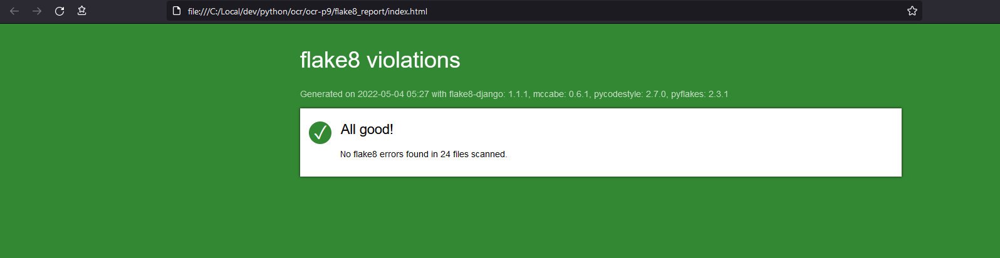

# ocr-p9 Développez une application Web en utilisant Django

Disclaimer

---

This code is part of the openclassrooms learning adventure split in 13 business alike projects.  
  
  
This one is to code a chess management app following the rules of Swiss tournament.  
Some materials or links may have rights to be granted by https://openclassrooms.com. 
The additionnal code follows "CC BY-SA ".
  
** Not to be used for production **  


---
## Objet.  
  
Développer une application qui permette de demander ou de publier des critiques de livres ou d’articles.
L’application présente deux cas d’utilisation principaux : 
1. Les personnes qui demandent des critiques sur un livre ou sur un article particulier ;
2. Les personnes qui recherchent des articles et des livres intéressants à lire, en se basant sur les  avis postés.
  
## Fonctionnement du logiciel

### Connexion
Un utilisateur doit être connecté pour accéder aux services de LitReview.

S'il ne possède pas encore de compte, l'utilisateur est invité à créer un nouveau compte dès la page d'accueil.

Une fois connecté, l'utilisateur visualise le flux des demandes et des critiques  qu'il a lui-même créées ainsi que celles d'autres membres qu'il a décidé de suivre.

### Abonnements
Afin de suivre un membre, l'utilisateur se rend sur la page "Abonnements".
Sur cette page, l'utilisateur peut :
1. s'abonner en sélectionnant dans la liste un membre qu'il souhaite suivre.
2. visualiser la liste des membres qui le suivent
3. visualiser la liste de ses abonnements et éventuellement s'y désabonner.

L'utilisateur ne peut s'abonner à lui-même.


### Flux et Posts

La page du Flux permet à l'utilisateur de consulter l'ensemble des demandes et des critiques de ses abonnements ou de lui-même. 
A partir de la page du flux principal, l'utilisateur peut également créer une nouvelle demande ou rédiger une critique.  
  
La page des Posts permet à l'utilisateur de consulter l'ensemble de ses demandes et critiques. Il peut alors les modifier ou les supprimer. Cependant, il ne peut supprimer une demande tant qu'il existe une critique qui y est rattachée.


---


## Installation

Pour utiliser les scripts,
il est conseillé sous le prompt bash python (ici cmd Anaconda3 sous Windows 10):

1.  de cloner l'ensemble du répertoire github dans un répertoire local dédié.
    git clone https://github.com/dev-KC20/ocr-p9.git

2.  se déplacer dans le sous répertoire de travail ocr-p9-main
    cd ocr-p9-main

3. créer un environnement virtuel python, env
    python -m venv env

4.  d'activer un environnement virtuel python, env
    env\scripts\activate.bat

5.  d'installer les paquets requis pour mémoire,
    pip install -r requirements.txt

6.  de créer un fichier .env sous le répertoire courant afin de contenir les "secrets" (cf. plus bas) :
    
        # SECURITY WARNING: keep the secret key used in production secret!
        SECRET_KEY = django-insecure-$2-ay)(y+p8e!!0eccn#s(rli^iuu^iy9$=d$s_r90setc#tm!
        DEBUG = True

7.  d'exécuter la migration des modèles 
    python manage.py migrate

8.  d'exécuter le script serveur 
    python manage.py runserver

9.  d'accéder à l'application LitReview servie par Django en cliquant sur :
    http://127.0.0.1:8000/


nb : une base de donnée pré-remplie, db.sqlite3 est à disposition pour un aperçu rapide. Les utilisateurs toto et tata ont leur nom pour mot de passe. Si vous souhaitez débuter avec une base de donnée vierge, il vous suffit de supprimer le fichier db.sqlite3 ; l'application en crééra un nouveau à la première connexion.
Pour un test plus simple la sécurité liée au mot de passe a été provisoirement diminuée.
Pour revenir à un standard plus fort, il faut décommenter les 3 contraintes correspondantes de settings.py situé sous le répertoire 'litreview' :

```py
AUTH_PASSWORD_VALIDATORS = [
    # {
    #     'NAME': 'django.contrib.auth.password_validation.UserAttributeSimilarityValidator',
    # },
    {
        "NAME": "django.contrib.auth.password_validation.MinimumLengthValidator",
        "OPTIONS": {
            "min_length": 4,
        },
    },
    # {
    #     'NAME': 'django.contrib.auth.password_validation.CommonPasswordValidator',
    # },
    # {
    #     'NAME': 'django.contrib.auth.password_validation.NumericPasswordValidator',
    # },
]

```


### Gestion des secrets

Django utilise un "secret" pour générer ses certificats et recommande de garder cette clé secrète. 
Nous utilisons le paquet python-decouple pour remplacer les clés de secret par leur valeur dans le fichier settings.py :
Le fait de stocker les secrets dans un fichier .env évite de le "committer" par accident sur un dépôt centralisé grâce au paramétrage de notre .gitignore.

S'agissant d'un exercice pédagogique, nous voulons permettre d'utiliser notre code source et éventuelles données tout en respectant les bonnes pratiques. C'est pourquoi nous affichons en clair ce secret dans les instructions d'installation de ce readme.

```py
from decouple import config
...
SECRET_KEY = config("SECRET_KEY")

```

Références: 

cf. [Réglages | Documentation de Django | Django](https://docs.djangoproject.com/fr/4.0/ref/settings/#password-hashers)

**Gardez cette valeur secrète.**
Le fonctionnement de Django avec une clé [`SECRET_KEY`](https://docs.djangoproject.com/fr/4.0/ref/settings/#std:setting-SECRET_KEY) connue réduit à néant de nombreuses protections de sécurité de Django et peut amener à une élévation de privilèges et à des vulnérabilités d’exécution de code à distance.

cf. [GitHub - henriquebastos/python-decouple: Strict separation of config from code.](https://github.com/henriquebastos/python-decouple/)

## [Python Decouple: Strict separation of settings from code](https://github.com/henriquebastos/python-decouple/#id1)
_Decouple_ helps you to organize your settings so that you can change parameters without having to redeploy your app.

If `SECRET_KEY` is not present in the `.env`, _decouple_ will raise an `UndefinedValueError`.
This _fail fast_ policy helps you avoid chasing misbehaviours when you eventually forget a parameter.


### Conformité PEP8

  

